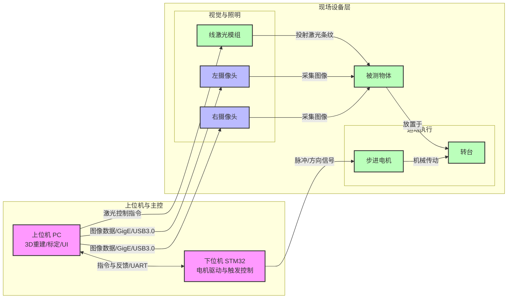
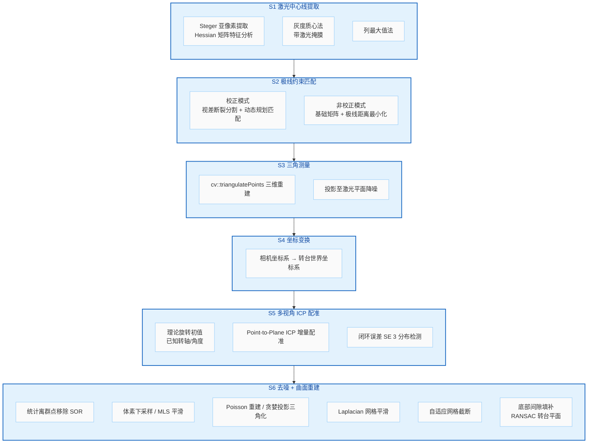

# 双目线激光转台三维重建系统

> Binocular Line Laser Turntable 3D Reconstruction System — v1.0

基于**双目视觉 + 线激光 + 旋转转台**的结构光三维扫描与重建系统。两台同步相机从不同视角拍摄激光条纹，结合转台旋转，通过立体匹配、三角测量、多视角配准与曲面重建，最终输出带纹理的三维网格模型。

---

## 硬件架构



---

## 功能特性

### 五步标定流程

| 步骤 | 功能 | 说明 |
|------|------|------|
| **1. 单目标定** | 左/右相机内参 + 畸变系数 | 张正友棋盘格标定法 |
| **2. 双目标定** | 双目外参 (R, T) | 立体校正或原始极线约束 |
| **3. 激光平面标定** | 激光平面方程 ax+by+cz+d=0 | RANSAC + SVD 拟合 |
| **4. 转轴标定** | 旋转轴方向 + 轴点 + 相机-转台位姿 | 3D 圆拟合 + LM 捆集调整 |
| **5. 系统标定** | 整合所有标定参数 | 用于三维重建流水线 |

### 六阶段三维重建流水线 (S1-S6)



---

## 技术栈

| 技术 | 版本 | 用途 |
|------|------|------|
| **C++17** | — | 主语言 |
| **CMake** | ≥ 3.16 | 构建系统 |
| **Qt 5** | Core, Widgets, Concurrent, OpenGL, SerialPort | GUI + 多线程 + 串口 |
| **OpenCV** | ≥ 4.4 | 图像处理、相机标定、SIFT、立体匹配、三角测量 |
| **PCL** | ≥ 1.12 | 点云处理、ICP 配准、滤波、Poisson/GP3 曲面重建 |
| **Eigen3** | — | 线性代数（矩阵运算、SVD） |
| **VTK** | 随 PCL / QVTKOpenGLWidget | 三维渲染 |

---

## 编译与构建

### 依赖安装

**Ubuntu / Debian:**
```bash
sudo apt install build-essential cmake \
    qt5-default libqt5opengl5-dev libqt5serialport5-dev \
    libopencv-dev libpcl-dev libeigen3-dev libvtk7-dev
```

**Windows (vcpkg):**
```bash
vcpkg install opencv[contrib] qt5 pcl eigen3
```

### 构建

```bash
git clone <repo-url> 3D_reconstruction
cd 3D_reconstruction
mkdir build && cd build
cmake .. -DCMAKE_BUILD_TYPE=Release
make -j$(nproc)
```

---

## 运行

```bash
cd build
./3D_reconstruction
```

程序启动后，按照五个标签页顺序操作：

1. **Tab1 双目采集** — 连接相机与串口，采集标定图像和扫描序列
2. **Tab2 相机标定** — 单目 + 双目立体标定
3. **Tab3 激光标定** — 激光中心线提取 + 平面标定
4. **Tab4 转轴标定** — 旋转轴方向 + 位姿标定
5. **Tab5 三维重建** — 配置 S1-S6 参数，运行完整重建流水线

标定结果自动保存至 `Resources/` 目录，重建结果可在三维视图中旋转/缩放查看。

---

## 项目结构

```
├── CMakeLists.txt              # CMake 构建配置
├── include/
│   ├── core/
│   │   ├── cameracalibration.h      # 单目 + 双目标定
│   │   ├── lasercalibration.h       # 激光条纹提取 + 平面拟合
│   │   ├── pointcalibrator.h        # SIFT 单点三维测量
│   │   ├── pointcloudbuilder.h      # S1-S6 重建流水线
│   │   ├── pointcloudviewer.h       # VTK 点云可视化
│   │   └── rotatingcalibrator.h     # 转台旋转轴标定
│   ├── io/
│   │   ├── camerathread.h           # 相机采集线程
│   │   ├── laserworker.h            # 激光批处理工作线程
│   │   └── serialportmanager.h      # STM32 串口通信
│   └── ui/
│       ├── logger.h                 # 线程安全日志
│       ├── mainwindow.h             # 主窗口 (5 标签页)
│       ├── theme.h                  # 工业白主题样式
│       └── videowidget.h            # 自定义视频显示组件
├── src/                        # 源文件（与 include 对应）
│   ├── main.cpp                    # 程序入口
│   ├── core/                       # 核心算法实现
│   ├── io/                         # I/O 实现
│   └── ui/                         # 界面实现
└── build/
    └── Resources/                  # 运行数据目录
        ├── Left/  Right/           # 左右相机标定图像
        ├── Left_laser/  Right_laser/     # 激光图像
        ├── Left_Platform/  Right_Platform/ # 转台旋转序列
        └── Left_PointCloud/  Right_PointCloud/ # 重建序列
```

---

## 关键技术细节

### Steger 激光中心线提取
基于 Hessian 矩阵特征值分析的亚像素精度条纹中心检测。在 LAB/HSV 颜色空间中构建红色激光掩膜，结合 Pauta 准则剔除离群点，支持过曝区域恢复。

### 旋转轴标定
双重方法保障精度：
- **3D 圆拟合法**（主要）：通过 PnP 求解各帧相机外参光心，将光心轨迹拟合为空间圆，圆的轴线即为旋转轴
- **PnP + Bundle Adjustment**（精化）：手动实现 Levenberg-Marquardt 优化器，Huber 损失函数，球坐标参数化旋转轴方向

系统根据 BA 重投影误差（阈值 20px）自动选择最优方法。

### ICP 多视角配准
- 以理论旋转矩阵（已知转轴和步进角度）为初始值
- Point-to-Plane ICP 增量精化
- 可配置转轴信任比（axis trust ratio）
- 闭环误差检测：全帧 SE(3) 误差分布分析

---

## 许可

本项目仅供学习与研究使用。

---

## 作者

Entzauberung
