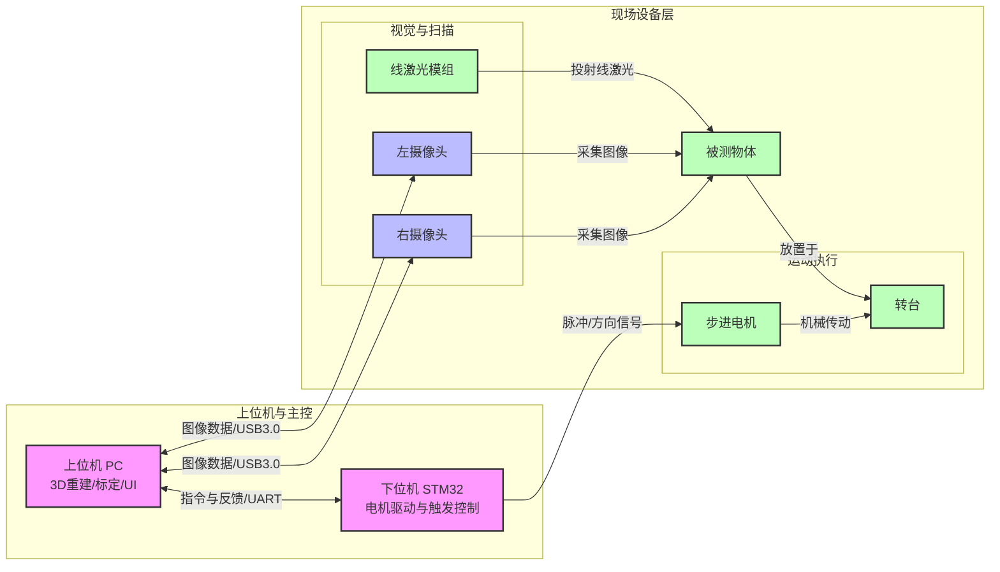
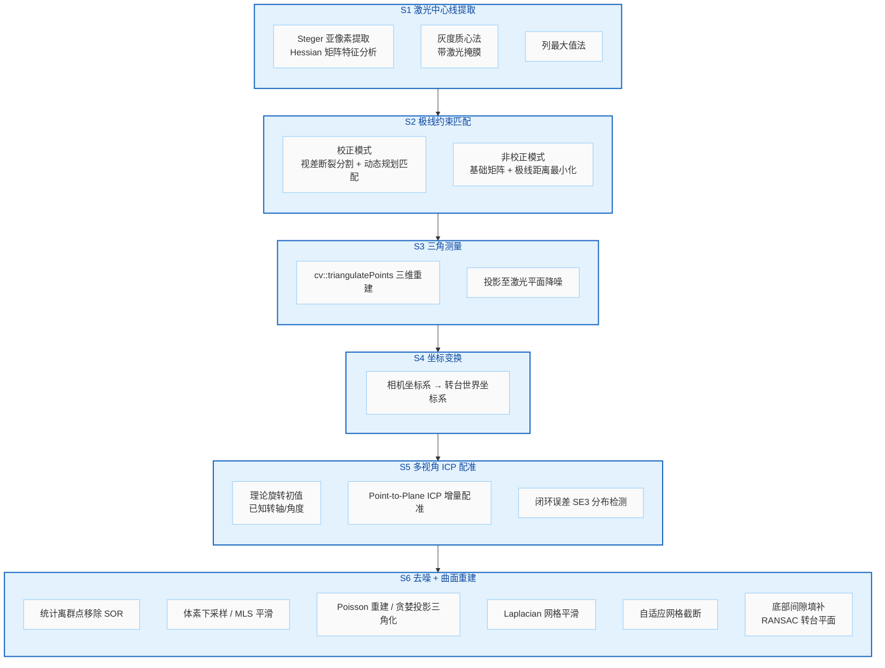

# 双目线激光转台三维重建系统

> Binocular Line Laser Turntable 3D Reconstruction System — v1.0

基于**双目视觉 + 线激光 + 旋转转台**的结构光三维扫描与重建系统。两台同步相机从不同视角拍摄激光条纹，结合转台旋转，通过立体匹配、三角测量与多视角配准得到被测物体的高精度点云和曲面模型。

---

## 硬件架构


```mermaid
flowchart LR
    %% 样式定义
    classDef control fill:#f9f,stroke:#333,stroke-width:2px;
    classDef data fill:#bbf,stroke:#333,stroke-width:2px;
    classDef physics fill:#bfb,stroke:#333,stroke-width:2px;
    classDef sync fill:#ffb,stroke:#333,stroke-width:2px;

    subgraph Host[上位机与主控]
        direction TB
        PC[上位机 PC<br>3D重建/标定/UI]:::control
        MCU[下位机 STM32<br>电机驱动与触发控制]:::control
    end

    subgraph Field[现场设备层]
        subgraph Vision[视觉与扫描]
            LC[左摄像头]:::data
            RC[右摄像头]:::data
            LL[线激光模组]:::physics
        end
        subgraph Motion[运动执行]
            SM[步进电机]:::physics
            TT[转台]:::physics
        end
        OBJ[被测物体]:::physics
    end

    %% 物理关系
    OBJ -->|放置于| TT
    LL -->|投射线激光| OBJ
    LC -->|采集图像| OBJ
    RC -->|采集图像| OBJ

    %% 数据流（PC 在上，向右上引出至摄像头）
    PC <-->|图像数据/USB3.0| LC
    PC <-->|图像数据/USB3.0| RC

    %% 控制流（PC 与 MCU 垂直连接，MCU 在下方向右引出至电机）
    PC <-->|指令与反馈/UART| MCU
    MCU -->|脉冲/方向信号| SM
    SM -->|机械传动| TT
```

---

## 功能特性

### 五步标定流程

| 步骤 | 功能 | 说明 |
|------|------|------|
| **1. 单目标定** | 左/右相机内参 + 畸变系数 | 张正友棋盘格标定法，亚像素角点细化 |
| **2. 双目标定** | 双目外参 (R, T) | 立体校正、计算本质矩阵/基础矩阵 |
| **3. 激光平面标定** | 激光平面方程 ax+by+cz+d=0 | 由激光中心线三维点用 RANSAC + SVD 拟合 |
| **4. 转轴标定** | 旋转轴方向 + 轴点 + 相机-转台位姿 | 3D 圆拟合 + 最小二乘/LM 捆集优化 |
| **5. 系统标定** | 整合所有标定参数 | 用于三维重建流水线 |

### 六阶段三维重建流水线 (S1-S6)


```mermaid
flowchart TD
    %% 定义样式
    classDef mainNode fill:#e3f2fd,stroke:#1565c0,stroke-width:2px,color:#0d47a1
    classDef subNode fill:#fafafa,stroke:#90caf9,stroke-width:1px,color:#333

    %% S1 模块
    subgraph S1 [S1 激光中心线提取]
        direction TB
        S1_1[Steger 亚像素提取<br/>Hessian 矩阵特征分析]:::subNode
        S1_2[灰度质心法<br/>带激光掩膜]:::subNode
        S1_3[列最大值法]:::subNode
    end

    %% S2 模块
    subgraph S2 [S2 极线约束匹配]
        direction TB
        S2_1[校正模式<br/>视差断裂分割 + 动态规划匹配]:::subNode
        S2_2[非校正模式<br/>基础矩阵 + 极线距离最小化]:::subNode
    end

    %% S3 模块
    subgraph S3 [S3 三角测量]
        direction TB
        S3_1[cv::triangulatePoints 三维重建]:::subNode
        S3_2[投影至激光平面降噪]:::subNode
    end

    %% S4 模块
    subgraph S4 [S4 坐标变换]
        S4_1[相机坐标系 → 转台世界坐标系]:::subNode
    end

    %% S5 模块
    subgraph S5 [S5 多视角 ICP 配准]
        direction TB
        S5_1[理论旋转初值<br/>已知转轴/角度]:::subNode
        S5_2[Point-to-Plane ICP 增量配准]:::subNode
        S5_3[闭环误差 SE3 分布检测]:::subNode
    end

    %% S6 模块
    subgraph S6 [S6 去噪 + 曲面重建]
        direction TB
        S6_1[统计离群点移除 SOR]:::subNode
        S6_2[体素下采样 / MLS 平滑]:::subNode
        S6_3[Poisson 重建 / 贪婪投影三角化]:::subNode
        S6_4[Laplacian 网格平滑]:::subNode
        S6_5[自适应网格截断]:::subNode
        S6_6[底部间隙填补<br/>RANSAC 转台平面]:::subNode
    end

    %% 主流程连接
    S1 --> S2 --> S3 --> S4 --> S5 --> S6

    %% 应用样式
    class S1,S2,S3,S4,S5,S6 mainNode
```

---

## 技术栈

| 技术 | 版本 | 用途 |
|------|------|------|
| **C++17** | — | 主语言 |
| **CMake** | ≥ 3.16 | 构建系统 |
| **Qt 5** | Core, Widgets, Concurrent, OpenGL, SerialPort | GUI + 多线程 + 串口 |
| **OpenCV** | ≥ 4.4 | 图像处理、相机标定、SIFT、立体匹配、三角测量 |
| **PCL** | ≥ 1.12 | 点云处理、ICP 配准、滤波、Poisson/GP3 曲面重建 |
| **Eigen3** | — | 线性代数（矩阵运算、SVD） |
| **VTK** | 随 PCL / QVTKOpenGLWidget | 三维渲染 |

---

## 编译与构建

### 依赖安装

**Ubuntu / Debian:**
```bash
sudo apt install build-essential cmake \
    qt5-default libqt5opengl5-dev libqt5serialport5-dev \
    libopencv-dev libpcl-dev libeigen3-dev libvtk7-dev
```

**Windows (vcpkg):**
```bash
vcpkg install opencv[contrib] qt5 pcl eigen3
```

### 构建

```bash
git clone <repo-url> 3D_reconstruction
cd 3D_reconstruction
mkdir build && cd build
cmake .. -DCMAKE_BUILD_TYPE=Release
make -j$(nproc)
```

---

## 运行

```bash
cd build
./3D_reconstruction
```

程序启动后，按照五个标签页顺序操作：

1. **Tab1 双目采集** — 连接相机与串口，采集标定图像和扫描序列
2. **Tab2 相机标定** — 单目 + 双目立体标定
3. **Tab3 激光标定** — 激光中心线提取 + 平面标定
4. **Tab4 转轴标定** — 旋转轴方向 + 位姿标定
5. **Tab5 三维重建** — 配置 S1-S6 参数，运行完整重建流水线

标定结果自动保存至 `Resources/` 目录，重建结果可在三维视图中旋转/缩放查看。

---

## 项目结构

```
├── CMakeLists.txt              # CMake 构建配置
├── include/
│   ├── core/
│   │   ├── cameracalibration.h      # 单目 + 双目标定
│   │   ├── lasercalibration.h       # 激光条纹提取 + 平面拟合
│   │   ├── pointcalibrator.h        # SIFT 单点三维测量
│   │   ├── pointcloudbuilder.h      # S1-S6 重建流水线
│   │   ├── pointcloudviewer.h       # VTK 点云可视化
│   │   └── rotatingcalibrator.h     # 转台旋转轴标定
│   ├── io/
│   │   ├── camerathread.h           # 相机采集线程
│   │   ├── laserworker.h            # 激光批处理工作线程
│   │   └── serialportmanager.h      # STM32 串口通信
│   └── ui/
│       ├── logger.h                 # 线程安全日志
│       ├── mainwindow.h             # 主窗口 (5 标签页)
│       ├── theme.h                  # 工业白主题样式
│       └── videowidget.h            # 自定义视频显示组件
├── src/                        # 源文件（与 include 对应）
│   ├── main.cpp                    # 程序入口
│   ├── core/                       # 核心算法实现
│   ├── io/                         # I/O 实现
│   └── ui/                         # 界面实现
└── build/
    └── Resources/                  # 运行数据目录
        ├── Left/  Right/           # 左右相机标定图像
        ├── Left_laser/  Right_laser/     # 激光图像
        ├── Left_Platform/  Right_Platform/ # 转台旋转序列
        └── Left_PointCloud/  Right_PointCloud/ # 重建序列
```

---

## 关键技术细节

下面补充更完整的技术细节，便于阅读代码与调参。

### 双目相机标定

- 角点检测与亚像素细化：使用张正友棋盘格检测，调用 OpenCV `findChessboardCorners` + `cornerSubPix` 做亚像素精确化。
- 相机模型与畸变：采用针孔相机模型，径向畸变 k1,k2,k3，切向畸变 p1,p2（可选扩展 k4,k5）。
- 优化与度量：使用 Levenberg–Marquardt 优化 reprojection error（OpenCV `calibrateCamera` / `stereoCalibrate`），输出 RMS 重投影误差作为质量指标。推荐 RMS < 0.2 px 为高质量采集。
- 立体校正：使用 `stereoRectify` 计算校正映射（`initUndistortRectifyMap`），并保存本质矩阵/基础矩阵用于非校正匹配时的极线约束。
- 实现细节：标定时启用合理的 flags（如 FIX_K3/ RationalModel 根据需要启用），在样张不足或棋盘遮挡时剔除异常视图。

### 激光中心线提取（S1）

- 预处理：针对红色激光，先转换到 HSV 或 CIELab 颜色空间，用颜色阈值构建粗掩膜，再用形态学开闭与高斯滤波降低噪声。
- Steger 脊线检测：基于二阶导数（Hessian）分析，计算像素处的主曲率与主方向，沿垂直方向插值得到亚像素中心线。关键参数：高斯尺度 sigma（与线宽对应，常用 0.8–1.5 px），非极大值抑制和最小响应阈值。
- 备选方法：灰度质心法（在二值化激光带内按列计算质心）与列最大值法（取亮度最大像素列）用于速度优先或对比验证。
- 异常剔除：使用 Pauta（3σ）或 MAD（中位数绝对偏差）去除跨列跳跃点；对孤立短段应用长度阈值过滤。
- 输出：每帧输出一维像素坐标及其像素级强度/置信度，后续配对与三角化使用此亚像素坐标。

### 激光平面标定

- 思路：将来自同一平面的多帧激光中心线点通过双目三角化得到若干三维点，使用 RANSAC 去掉离群点，然后对内点求解平面方程（SVD 最小二乘）。
- 鲁棒性：RANSAC 设置迭代次数和内点阈值（例如 0.5–2 mm），并在最终内点集上做一次 SVD 精调以减少偏差。
- 结果验证：统计拟合残差 RMSE，记录平均点到平面距离与标准差作为质量指标。

### 旋转轴标定

- 初始估计：对每个转台角度采集棋盘格或已知标志物，使用 solvePnP 获得相机位姿（光心/相机中心）。
- 光心轨迹拟合：将相机光心（或某一参考点）在不同角度下的三维位置拟合到空间圆，采用代数圆拟合得到圆心、半径与平面法向（圆所在平面），圆的法向即为旋转轴方向。
- 优化：使用 Levenberg–Marquardt 对旋转轴参数（轴向向量、轴上一点、每帧角度偏差）和相机位姿做联合最小二乘（bundle adjustment），约束每帧位姿为绕同一轴旋转。
- 精度控制：剔除步进不连续或反向跳变的角度数据，最终指标包括共圆残差、轴向夹角以及左右相机独立拟合偏差。

### 双目极线约束匹配（S2）

- 校正模式（推荐）：对图像做立体校正，匹配限制在同一扫描行（视差搜索），代价函数可选 SAD/SSD、Census 或 NCC。为应对激光条纹的细长结构，优先使用基于条纹亮度的代价并加入平滑项。
- 非校正模式：使用基础矩阵将点映射为极线，匹配通过最小化极线距离（并结合灰度相似度）完成。
- 动态规划与断裂处理：对每列（或行）视差序列使用动态规划（DP）求出全局最优的匹配路径，能自然处理遮挡与断裂；配合左右一致性检查剔除单侧匹配错误。
- 亚像素视差：对匹配代价曲线做二次插值或抛物线拟合实现亚像素视差提升（常见精度 0.1–0.3 px）。
- 参数建议：视差搜索范围依据激光平面-相机几何预估（通常几十到几百像素），DP 惩罚项需根据噪声调优以避免过度平滑条纹断裂处。

### 三角化与错配剔除（S3）

- 三角化：使用 OpenCV `triangulatePoints`（齐次坐标）得到空间点，归一化后转换为欧式坐标。
- 可视性与深度检查：剔除深度为负或接近零的点（相机前方），剔除在任意相机视野外的重投影点。
- 重投影误差剔除：计算三维点重投影到左右图像的像素误差，阈值通常取 0.5–2.0 px （根据标定质量调整），超限点视为错配并剔除。
- 激光平面一致性：点到激光平面的距离应小于阈值（例如 1–3 mm），不符合的点可能为错配或检测噪声。
- 统计滤波：对结果点云采用基于邻域的离群点移除（Radius / SOR）进一步清理错误点。

### 坐标变换（S4）

- 目标：将相机坐标系下的三维点投影到转台世界坐标系，使不同旋转角度下的点云能在同一坐标系下累积。
- 变换链：三角化结果先在相机坐标系（左/右） → 使用外参转换到相机外参基准 → 应用旋转（绕标定得到的转轴）和平移到转台坐标系。
- 实现细节：使用 Eigen/Sophus 管理 SE(3) 变换，注意旋转方向与角度单位（弧度/度）一致性；对整数角度步进误差做插值或补偿。

### 多视角 ICP 配准（S5）

- 初始位姿：利用已知转台角度和轴心得到理论初始位姿，显著降低 ICP 的收敛区域。
- ICP 算法：采用 Point-to-Plane ICP（PCL 实现或自实现），使用法线估计（邻域 PCA）作为配准约束，可加速收敛并提高精度。
- 加速与鲁棒性：先做体素下采样（Voxel Grid）降低点数，再逐级细化；在配对阶段使用距离与法线角度门限过滤不可信对应点。
- 闭环与全局优化：当数据为多圈或大视角时，构建位姿图并用后端优化（g2o / Ceres）进行全局捆绑以修正累计误差。

### 去噪与曲面重建（S6）

- 点云滤波：先使用 SOR（StatisticalOutlierRemoval，meanK≈30–100，stddevMulThresh≈1.0）和 Radius 再移除孤立点。
- 平滑：使用 MLS（Moving Least Squares）或 Laplacian 平滑（迭代次数与边界保护）降低测量噪声。
- 曲面重建：两种主流方案
  - Poisson 重建（适合闭合、噪声较低的数据）：深度参数（depth）控制细节层级，通常 8–12。
  - 贪婪投影三角化（GP3）：对有边界的非闭合数据更鲁棒，需合理设置近邻数与搜索半径。
- 网格后处理：使用 Laplacian 平滑、法向一致化与自适应网格截断移除细碎面片；底部间隙可用 RANSAC 拟合转台平面并填补或截断多余区域。

### 典型参数与性能建议

- Steger sigma: 0.8–1.5（根据激光带宽），质心法适用于低对比或弱光。
- 动态规划平滑系数、视差搜索窗口需结合相机基线与激光平面几何设定。
- SOR: meanK=30–100，stddevMulThresh=1.0
- Poisson depth: 8–12（硬件资源与期望细节的权衡）
- 采集建议：使用外置触发确保两个相机同步，曝光优先保证激光带不过曝且背景尽可能暗以提高 SNR。

---

## 最终成果

### 单目标定
 - **单目标定 RMS**: L(均值 0.129px / 最大 0.161px)、R(均值 0.091px / 最大 0.149px)

### 双目立体标定
 - **立体标定 RMS**: 0.157942 px

### 光平面标定
 - **平均极线Y误差**: 0.24 px
 - **拟合误差 RMSE**: 0.2711 mm

### 旋转轴标定
 - **步长均匀性**：均值 1.804° / 标准差 0.272°（注：最大误差来源，步进电机精度上限）
 - **棋盘姿态一致性**：法向与轴夹角 0.06° ± 0.03°
 - **共圆残差**: 0.0572 mm、0.0595 mm
 - **左右独立拟合圆心偏差**： 0.050 mm
 - **3D 圆拟合轴**：0.0156°

### 三维重建

| 阶段 | 数量 | 占上一阶段 |
|---|---|---|
| 左图提取光条点 | 83545 | — |
| 右图提取光条点 | 69881 | 右/左比 **0.84** |
| 极线匹配对数 | 60191 | 72.0% |
| 光平面一致性检测有效点数 | 60191 | **100.0%** |
| 最终点云 (位姿核对/去噪 后) | 59107 | **98.20%** |

 - **闭环诊断**：增量累计 rot:41.40° → 全量均摊(每帧-0.066°)
 - **融合后轴点偏差**: 1.29 mm


---
