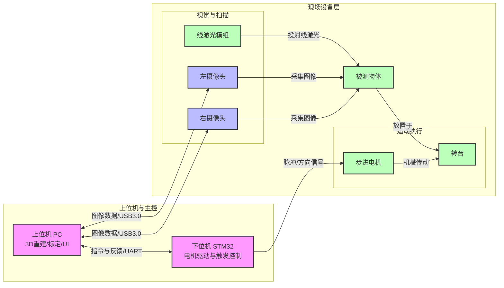

# 双目线激光转台三维重建系统

> Binocular Line Laser Turntable 3D Reconstruction System — v1.0

基于**双目视觉 + 线激光 + 旋转转台**的结构光三维扫描与重建系统。两台同步相机从不同视角拍摄激光条纹，结合转台旋转，通过立体匹配、三角测量、多视角配准与曲面重建，最终输出带纹理的三维网格模型。

---

## 硬件架构


```mermaid
flowchart LR
    %% 样式定义
    classDef control fill:#f9f,stroke:#333,stroke-width:2px;
    classDef data fill:#bbf,stroke:#333,stroke-width:2px;
    classDef physics fill:#bfb,stroke:#333,stroke-width:2px;
    classDef sync fill:#ffb,stroke:#333,stroke-width:2px;

    subgraph Host[上位机与主控]
        direction TB
        PC[上位机 PC<br>3D重建/标定/UI]:::control
        MCU[下位机 STM32<br>电机驱动与触发控制]:::control
    end

    subgraph Field[现场设备层]
        subgraph Vision[视觉与扫描]
            LC[左摄像头]:::data
            RC[右摄像头]:::data
            LL[线激光模组]:::physics
        end
        subgraph Motion[运动执行]
            SM[步进电机]:::physics
            TT[转台]:::physics
        end
        OBJ[被测物体]:::physics
    end

    %% 物理关系
    OBJ -->|放置于| TT
    LL -->|投射线激光| OBJ
    LC -->|采集图像| OBJ
    RC -->|采集图像| OBJ

    %% 数据流（PC 在上，向右上引出至摄像头）
    PC <-->|图像数据/USB3.0| LC
    PC <-->|图像数据/USB3.0| RC

    %% 控制流（PC 与 MCU 垂直连接，MCU 在下方向右引出至电机）
    PC <-->|指令与反馈/UART| MCU
    MCU -->|脉冲/方向信号| SM
    SM -->|机械传动| TT
```

---

## 功能特性

### 五步标定流程

| 步骤 | 功能 | 说明 |
|------|------|------|
| **1. 单目标定** | 左/右相机内参 + 畸变系数 | 张正友棋盘格标定法 |
| **2. 双目标定** | 双目外参 (R, T) | 立体校正或原始极线约束 |
| **3. 激光平面标定** | 激光平面方程 ax+by+cz+d=0 | RANSAC + SVD 拟合 |
| **4. 转轴标定** | 旋转轴方向 + 轴点 + 相机-转台位姿 | 3D 圆拟合 + LM 捆集调整 |
| **5. 系统标定** | 整合所有标定参数 | 用于三维重建流水线 |

### 六阶段三维重建流水线 (S1-S6)


```mermaid
flowchart TD
    %% 定义样式
    classDef mainNode fill:#e3f2fd,stroke:#1565c0,stroke-width:2px,color:#0d47a1
    classDef subNode fill:#fafafa,stroke:#90caf9,stroke-width:1px,color:#333

    %% S1 模块
    subgraph S1 [S1 激光中心线提取]
        direction TB
        S1_1[Steger 亚像素提取<br/>Hessian 矩阵特征分析]:::subNode
        S1_2[灰度质心法<br/>带激光掩膜]:::subNode
        S1_3[列最大值法]:::subNode
    end

    %% S2 模块
    subgraph S2 [S2 极线约束匹配]
        direction TB
        S2_1[校正模式<br/>视差断裂分割 + 动态规划匹配]:::subNode
        S2_2[非校正模式<br/>基础矩阵 + 极线距离最小化]:::subNode
    end

    %% S3 模块
    subgraph S3 [S3 三角测量]
        direction TB
        S3_1[cv::triangulatePoints 三维重建]:::subNode
        S3_2[投影至激光平面降噪]:::subNode
    end

    %% S4 模块
    subgraph S4 [S4 坐标变换]
        S4_1[相机坐标系 → 转台世界坐标系]:::subNode
    end

    %% S5 模块
    subgraph S5 [S5 多视角 ICP 配准]
        direction TB
        S5_1[理论旋转初值<br/>已知转轴/角度]:::subNode
        S5_2[Point-to-Plane ICP 增量配准]:::subNode
        S5_3[闭环误差 SE 3 分布检测]:::subNode
    end

    %% S6 模块
    subgraph S6 [S6 去噪 + 曲面重建]
        direction TB
        S6_1[统计离群点移除 SOR]:::subNode
        S6_2[体素下采样 / MLS 平滑]:::subNode
        S6_3[Poisson 重建 / 贪婪投影三角化]:::subNode
        S6_4[Laplacian 网格平滑]:::subNode
        S6_5[自适应网格截断]:::subNode
        S6_6[底部间隙填补<br/>RANSAC 转台平面]:::subNode
    end

    %% 主流程连接
    S1 --> S2 --> S3 --> S4 --> S5 --> S6

    %% 应用样式
    class S1,S2,S3,S4,S5,S6 mainNode
```

---

## 技术栈

| 技术 | 版本 | 用途 |
|------|------|------|
| **C++17** | — | 主语言 |
| **CMake** | ≥ 3.16 | 构建系统 |
| **Qt 5** | Core, Widgets, Concurrent, OpenGL, SerialPort | GUI + 多线程 + 串口 |
| **OpenCV** | ≥ 4.4 | 图像处理、相机标定、SIFT、立体匹配、三角测量 |
| **PCL** | ≥ 1.12 | 点云处理、ICP 配准、滤波、Poisson/GP3 曲面重建 |
| **Eigen3** | — | 线性代数（矩阵运算、SVD） |
| **VTK** | 随 PCL / QVTKOpenGLWidget | 三维渲染 |

---

## 编译与构建

### 依赖安装

**Ubuntu / Debian:**
```bash
sudo apt install build-essential cmake \
    qt5-default libqt5opengl5-dev libqt5serialport5-dev \
    libopencv-dev libpcl-dev libeigen3-dev libvtk7-dev
```

**Windows (vcpkg):**
```bash
vcpkg install opencv[contrib] qt5 pcl eigen3
```

### 构建

```bash
git clone <repo-url> 3D_reconstruction
cd 3D_reconstruction
mkdir build && cd build
cmake .. -DCMAKE_BUILD_TYPE=Release
make -j$(nproc)
```

---

## 运行

```bash
cd build
./3D_reconstruction
```

程序启动后，按照五个标签页顺序操作：

1. **Tab1 双目采集** — 连接相机与串口，采集标定图像和扫描序列
2. **Tab2 相机标定** — 单目 + 双目立体标定
3. **Tab3 激光标定** — 激光中心线提取 + 平面标定
4. **Tab4 转轴标定** — 旋转轴方向 + 位姿标定
5. **Tab5 三维重建** — 配置 S1-S6 参数，运行完整重建流水线

标定结果自动保存至 `Resources/` 目录，重建结果可在三维视图中旋转/缩放查看。

---

## 项目结构

```
├── CMakeLists.txt              # CMake 构建配置
├── include/
│   ├── core/
│   │   ├── cameracalibration.h      # 单目 + 双目标定
│   │   ├── lasercalibration.h       # 激光条纹提取 + 平面拟合
│   │   ├── pointcalibrator.h        # SIFT 单点三维测量
│   │   ├── pointcloudbuilder.h      # S1-S6 重建流水线
│   │   ├── pointcloudviewer.h       # VTK 点云可视化
│   │   └── rotatingcalibrator.h     # 转台旋转轴标定
│   ├── io/
│   │   ├── camerathread.h           # 相机采集线程
│   │   ├── laserworker.h            # 激光批处理工作线程
│   │   └── serialportmanager.h      # STM32 串口通信
│   └── ui/
│       ├── logger.h                 # 线程安全日志
│       ├── mainwindow.h             # 主窗口 (5 标签页)
│       ├── theme.h                  # 工业白主题样式
│       └── videowidget.h            # 自定义视频显示组件
├── src/                        # 源文件（与 include 对应）
│   ├── main.cpp                    # 程序入口
│   ├── core/                       # 核心算法实现
│   ├── io/                         # I/O 实现
│   └── ui/                         # 界面实现
└── build/
    └── Resources/                  # 运行数据目录
        ├── Left/  Right/           # 左右相机标定图像
        ├── Left_laser/  Right_laser/     # 激光图像
        ├── Left_Platform/  Right_Platform/ # 转台旋转序列
        └── Left_PointCloud/  Right_PointCloud/ # 重建序列
```

---

## 关键技术细节

### 双目相机标定
角点检测与亚像素细化

### 激光中心线提取
 **Steger 脊线检测**：基于 Hessian 矩阵特征值分析的亚像素精度条纹中心检测。在 LAB/HSV 颜色空间中构建红色激光掩膜，结合 Pauta 准则剔除离群点，支持过曝区域恢复。

### 旋转轴标定
 **3D 圆拟合法**：通过 PnP 求解各帧相机外参光心，将光心轨迹拟合为空间圆，圆的轴线即为旋转轴

### 双目极线约束匹配

### 三角化与错配剔除

## 最终成果
### 单目标定
 - **单目标定 RMS**: L(均值 0.129px / 最大 0.161px)、R(均值 0.091px / 最大 0.149px)

### 双目立体标定
 - **立体标定 RMS**: 0.157942 px

### 光平面标定
 - **平均极线Y误差**: 0.24 px
 - **拟合误差 RMSE**: 0.2711 mm

### 旋转轴标定
 - **步长均匀性**：均值 1.804° / 标准差 0.272°（注：最大误差来源，步进电机精度上限）
 - **棋盘姿态一致性**：法向与轴夹角 0.06° ± 0.03°
 - **共圆残差**: 0.0572 mm、0.0595 mm
 - **左右独立拟合圆心偏差**： 0.050 mm
 - **3D 圆拟合轴**：0.0156°

### 三维重建

| 阶段 | 数量 | 占上一阶段 |
|---|---|---|
| 左图提取光条点 | 83545 | — |
| 右图提取光条点 | 69881 | 右/左比 **0.84** |
| 极线匹配对数 | 60191 | 72.0% |
| 光平面一致性检测有效点数 | 60191 | **100.0%** |
| 最终点云 (位姿核对/去噪 后) | 59107 | **98.20** |

 - **闭环诊断**：增量累计 rot:41.40° → 全量均摊(每帧-0.066°)
 - **融合后轴点偏差**: 1.29 mm


---
